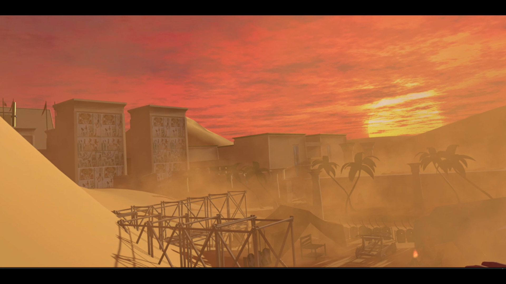
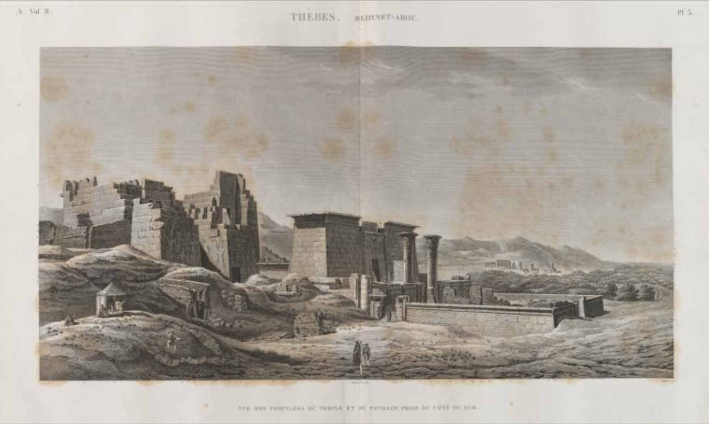
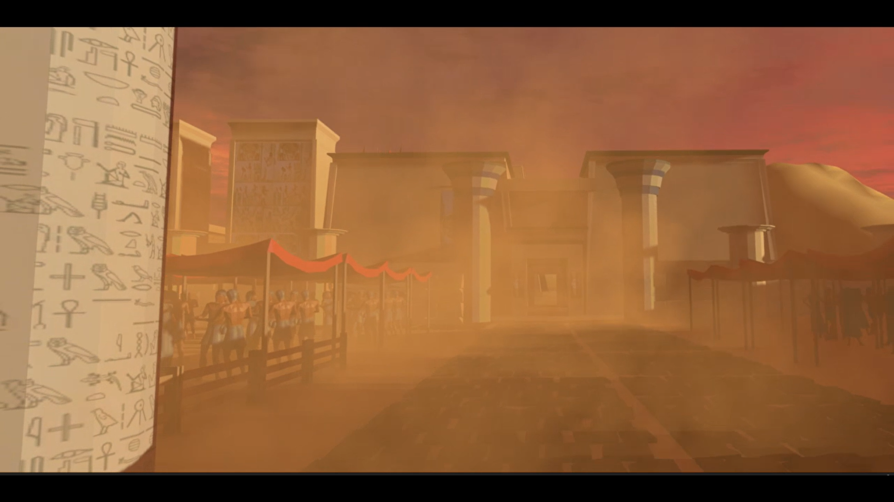
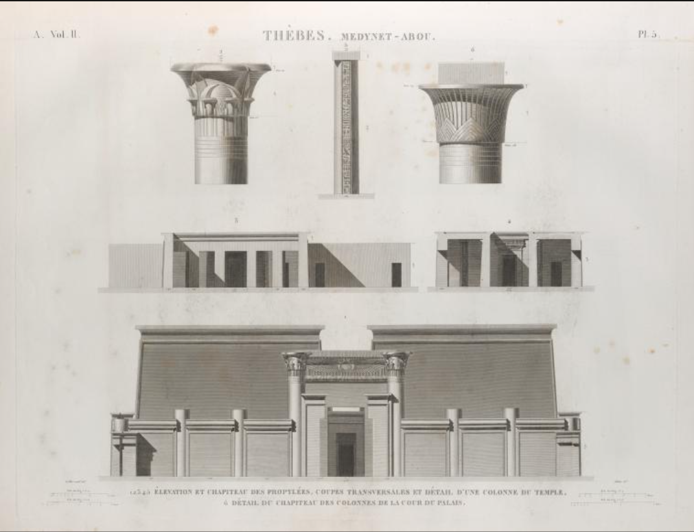

# VR-Ancient-Egypt-Exploration

### The Project
The Network Institute at Vrije Universiteit is making headway in interdisciplinary research on the digital society. The institute's mission is to understand, challenge, and research the theme of the digital society. In doing so, the institute supports the collaboration between researchers, students, and organizations from diverse backgrounds.

As part of the Artificial Intelligence Honours Programme at Vrije University and the course "Discovering Nature" from the University of Amsterdam, I (T.Mencattini) and L.Tisci had the opportunity to work on an interdisciplinary project inspired by the "Description de l'Egypte". While the course "Discovering Nature" aimed to highlight the crucial role that art played as an epistemic tool in the development of natural sciences in the 18th and 19th centuries, our project aimed to explore how science and technology can play a central role in projects in the field of humanities and arts. The project centered around the Temple of Ramses III in Medinet Habu and aimed to rebuild the temple in Unity. The main objective was not to create an exact replica but to build an immersive environment that evokes the sense of discovery that the authors of "Description de l'Egypte" felt while exploring Egypt. The project utilized the images and information from that work to reconstruct the temple.

The Network Institute provided us with access to computers and virtual reality equipment from the Game Cella Lab on a weekly basis, enabling us to carry out our project.
The focus of the Network Institute on interdisciplinary research aligns with the goals of our project. As digital technologies continue to shape and impact society, it is crucial to have a multidisciplinary approach to different fields of study, even in the most artistic fields. Our project aims to achieve this interdisciplinary focus by supporting an artistic and historical project using cutting-edge technologies.

  
   

  
   

### Final Video

The final video of the project can be accessed through this link: https://youtu.be/xMC9_qskFIg

### Credits

Images' scans: https://digitalcollections.nypl.org/collections/description-de-lgypte-ou-recueil-des-observations-et-des-recherches-qui-ont-t#/?tab=navigation

Music in the video: https://www.youtube.com/watch?v=jdFwhhH2x7I&ab_channel=oldmoviemusic

Music in the demo: https://m.youtube.com/watch?v=JV4Td91MfkY

Main assets used: https://assetstore.unity.com/packages/3d/environments/historic/ancient-egypt-pack-low-poly-189720
